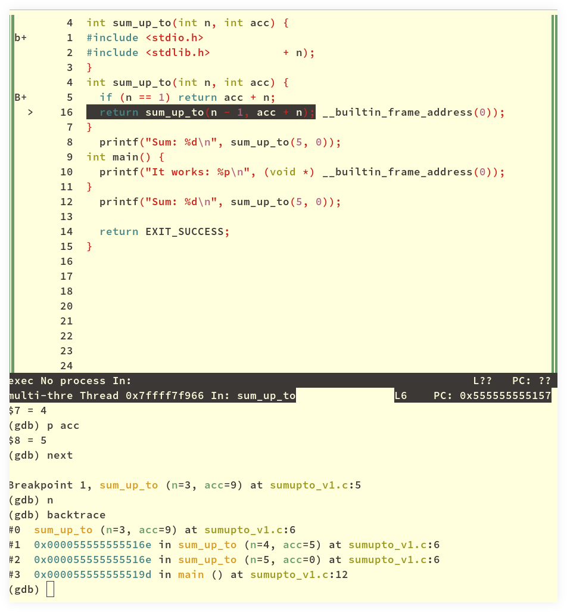

= GDB: The GNU Project Debugger
:icons: font
:toc: left
:experimental:

== Intro

- link:https://www.sourceware.org/gdb/[Official GDB page^].

Getting started:

[source,text]
----
$ gcc -std=c99 -Wall -pedantic sum_up_to.c -o sum_up_to
$ gdb ./sum_up_to
break main
run
----

Now we can:

* `list`, `l`: list (show, print) the code.
* `step`, `s`: steps into the function.
* `next`, `n`: steps over the function.
* `clear`, `cl`: (clears the breakpoints).
* `backtrace`, `bt`: shows the backtrace.
* `continue`, `c`: continues to run until the next breakpoint or watch point.
* `print`, `p`: prints the value of a reference, like `p x`, or `p my_arr`.
* kbd:[Enter]: repeats the last command

