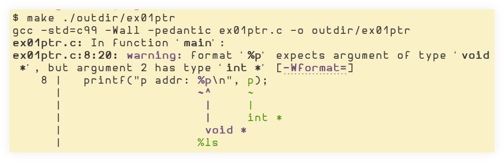

= C Pointers
:toc: right
:icons: font
:source-highlighter: highlight.js
:stem: latexmath
:imagesdir: ./__assets

== Intro

A pointer is a variable that stores the address where a piece of data is located.
It does not store the data itself.
A pointer's “data” is a memory address.
A pointer can point to nothing at all when it is set to `NULL`.
A pointer can be made to point to an _invalid address_, which is then called a _dangling pointer_.

Programming errors that lead to dangling pointers include (non-exhaustive list):

* Cast integers to pointers.
* Access out-of-bounds array locations.
* Deallocate memory which is still being referenced by pointers.

== Storage Allocation

When a pointer is declared, some amount of space in memory is allocated.
A pointer generally take a machine word, but their size can vary depending on the architecture or other things, like compiler settings or type specifiers allowed by certain C implementations.

When a pointer is declared, memory is allocated only for the address the pointer will store, not for the data stored at that address.

Storage for the data can be allocated by declaring a variable for it or by using functions like `malloc` its relatives.

=== Automatic Variables

Automatic variables are those in which allocation and deallocation is handled automatically.
Be extra careful when using pointers to automatic variables:

[source,c]
----
int f(int **iptr) {
  int x = 1;
  *iptr = &x;

  return 0;
}
----

`x` is an automatic variable (after `f()` returns, `x` is deallocated automatically).
When `f()` returns, `x` is deallocated, which means `iptr` has become a dangling pointer.

When memory is dynamically allocated, we are given a pointer to some address on the heap.
That storage remains valid until we deallocate it explicitly.
It remains valid even after the function that allocated it in the first place returns.

== Syntax

`*` is used both to declare a pointer _and_ to access the value the pointer points to.
When it means each is determined by the context.

`int *p = &x` causes `p` to point to the memory address of `x`.

`printf("%d", \*p)` means “look for the address stored in `p` and retrieve the value stored at that address.”
In other words, *read* the value stored at `p`.

`*p = 5` replaces the old value at `p` with 5.

`&` and `*` are opposites.
The former gives the address of something, while the latter gives the value stored at some address.

Pointers are also known as _references_ (to addresses).
`\*` is said to *dereference* a pointer.

== Print pointer address with %p

.invalid type for %p
[source,c]
----
#include <stdio.h>

int main () {
  int *p;
  int x = 3;
  p = &x;

  printf("p addr: %p\n", p);
  printf("*p val: %i\n", *p);
}
----

.compiling
----
$ make ./outdir/ex01ptr
gcc -std=c99 -Wall -pedantic ex01ptr.c -o outdir/ex01ptr
ex01ptr.c: In function ‘main’:
ex01ptr.c:8:20: warning: format ‘%p’ expects argument of type ‘void *’, but argument 2 has type ‘int *’ [-Wformat=]
    8 |   printf("p addr: %p\n", p);
      |                   ~^     ~
      |                    |     |
      |                    |     int *
      |                    void *
      |                   %ls
----

Replace:

[source,c]
----
printf("%p", p);
----

with:

[source,c]
----
printf("%p", (void *)p);
----

On Arch Linux:

.man 3 printf on Arch Linux as of 2022
----
p   The void * pointer argument is printed in
    hexadecimal (as if by %#x or %#lx).
----

== sizeof pointers and function parameters

[source,c]
----
#include <stdio.h>

void f(char s[])
{
  printf("f: %ld\n", sizeof(s));
  //=> 8 <2>
}

int main()
{
  char cs[] = "tux";

  printf("main: %ld\n", sizeof(cs));
  //=> 4 <1>

  f(cs);

  return 0;
}
----

1. Size of pointer to char on my machine at the time of this writing.
"tux" is `{ 't', 'u', 'x', '\0' }`.
Three bytes for each char plus one byte for the NUL terminator.

2. In the function, `s` becomes a pointer (to the address of the first char n the original array in main).
On “this machine”, a pointer to char takes 8 bytes.

In `main`, `cs` is a *char array*.
When passed to the `f`, it becomes a (constant) pointer.

== Memory Leaks

A memory leak happens when there is no longer any reference to an existing dynamically allocated piece of storage on the heap.

All dynamically allocated memory should bee ``free``'d, but if there is no longer any reference to its location, it becomes impossible to free it, thus, the memory leak occurs.

=== Struct Example

Consider this code:

[source,c]
----
#include <stdio.h>
#include <stdlib.h>
#include <string.h>

typedef struct Jedi_ {
  char *name;
  short level;
} Jedi;

Jedi *create(const char *name, short level) {
  Jedi *jedi = malloc(sizeof(Jedi));

  /* Assign a copy of the string, not a reference to
   * the original string. */
  jedi->name = strdup(name);
  jedi->level = level;

  return jedi;
}

int main(void) {
  Jedi *ahsoka = create("Ahsoka Tano", 97);

  printf("%s is level %hd.\n", ahsoka->name, ahsoka->level);

  free(ahsoka);

  return 0;
}
----

It creates a struct with dynamically allocated memory, and one of the fields of the struct is a pointer to `char` which is assigned the result of `strdup()`, which allocates memory for the dup'ed string and returns the pointer to that memory on the heap.

Then we compile the program and run the program:

[source,shell-session]
----
$ gcc \
    -std=gnu99 \
    -Og \
    -g3 \
    -Wall \
    -Wextra \
    -Wpedantic \
    -fsanitize=address,undefined \
    leak_struct.c \
    -o ./out/leak_struct

$ ./out/leak_struct
Ahsoka Tano is level 97.

=================================================================
==616721==ERROR: LeakSanitizer: detected memory leaks

Direct leak of 12 byte(s) in 1 object(s) allocated from:
    #0 0x7fb62d46c32a in __interceptor_strdup /usr/src/debug/gcc/gcc/libsanitizer/asan/asan_interceptors.cpp:454
    #1 0x55c19d9cc23c in create /home/deveng/work/src/devnotes/src/C/leak_struct.c:15

SUMMARY: AddressSanitizer: 12 byte(s) leaked in 1 allocation(s).
----

image:c-memory-leak-free-struct-2023-12-01T09-54-04-861Z.png[C memory leak with free on struct]

When `free(ahsoka)` is run, it de-allocates memory for the struct, causing the reference to the `name` which was dynamically allocated memory through the use of `strdup()` is lost.

To fix the problem, at least one way is to first free the memory on the `name` field, _then_ free the struct itself:

[source,diff]
----
  int main(void) {
    Jedi *ahsoka = create("Ahsoka Tano", 97);

    printf("%s is level %hd.\n", ahsoka->name, ahsoka->level);

+   free(ahsoka->name);
    free(ahsoka);

    return 0;
  }
----
