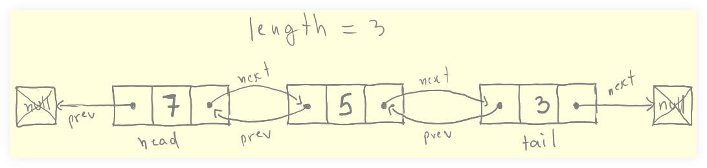

= Doubly Linked Lists
:page-tags: data-structure list singly-linked-list
:toc: right
:stem: latexmath
:icons: font

== Intro to Doubly Linked Lists

Structurally similar to singly linked lists, except every node also has a pointer to the *previous* node.
Doesn't change much in the structures, but allows a more performant implementation of some of its operations.

* No indexes.
* Nodes are connected through `next` and `prev` _pointers_.
* No random access (have to “walk the list”, but now can also traverse backwards).
* Inexpensive insertion and deletion.

Sometimes, reversing a doubly linked list is not necessary as we *can* traverse backwards.

The implementation of the operations get a little more complicated because now two pointers (`prev` and `next`) have to be accounted for.

Because two pointers on each node (`prev` and `next`, instead of just `next` for singly linked lists), more memory is required.

== Node Class

[source,js]
----
class Node {
  constructor(val) {
    this.val = val;
    this.prev = null;
    this.next = null;
  }
}

var foo = new Node(70);
var bar = new Node(30);
var qux = new Node(50);

bar.prev = foo;
foo.next = bar;

bar.next = qux;
qux.prev = bar;
----
