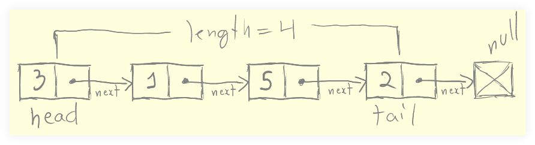

= Singly Linked Lists
:page-tags: data-structure list singly-linked-list
:toc: right
:stem: latexmath
:icons: font

== Intro to Singly Linked Lists

A Singly Linked List is a data structure which contains the properties *head*, *tail* and *length*.

It contains *nodes* (not indexes, like arrays), an each node has a *value* and a *pointer to another node*.
The pointer can be `null` if does not point to another node.

The name _singly linked_ comes from the fact that each node is connected unidirectionally to a single other node.

If you want the 19th element of a singly linked list, you have to traverse from beginning to the wanted node.
Unlike arrays, we cannot say “give me the 19th” element (which is stem:[O(1)] access time complexity).

Singly Liked Lists:

* No indexes.
* Nodes are connected through a `next` _pointer_.
* No random access (have to “walk the list”).
* Inexpensive insertion and deletion.

Arrays:

* Indexed in order.
* Potentially expensive insertion and deletion.
* Quick, stem:[O(1)] access time.

If what is really important in a given situation is fast insertion and deletion of elements (and random fast access is not important), then a linked list is a good choice.

== push(val)

To push a value to the singly linked list:

1. Create a new node with the value passed.
2. If the list is empty:
a. Add the new node as both the `head` and the `tail` of the list.
3. If the list is not empty:
a. Add the new node both as the `next` pointer and head's next pointer.
4. Return .

== pop()

Popping means to remove and return the last item of a list.

Observe that singly linked lists do not have a backwards pointer.
There is no way to move from the end to the beginning, only from beginning to end.

To pop an element from the list we have to set a new tail, and considering the previous paragraph, we have to traverse from the beginning to find the new tail.

So, to pop an item from the list, we have to find the node just before the tail, and make it become the tail.

1. If the list is empty, return `undefined`.
2. Loop from `head` to `tail` making sure you always have a reference to the previous node (when the loop reaches the end, this reference will be the penultimate element of the list).
3. Set `next` on the penultimate node to `null` (thus deleting the current tail).
4. Set the tail to be that reference to the penultimate element of the list.
6 Decrement `length` by 1.
5. Return the penultimate (the element before the original tail).
