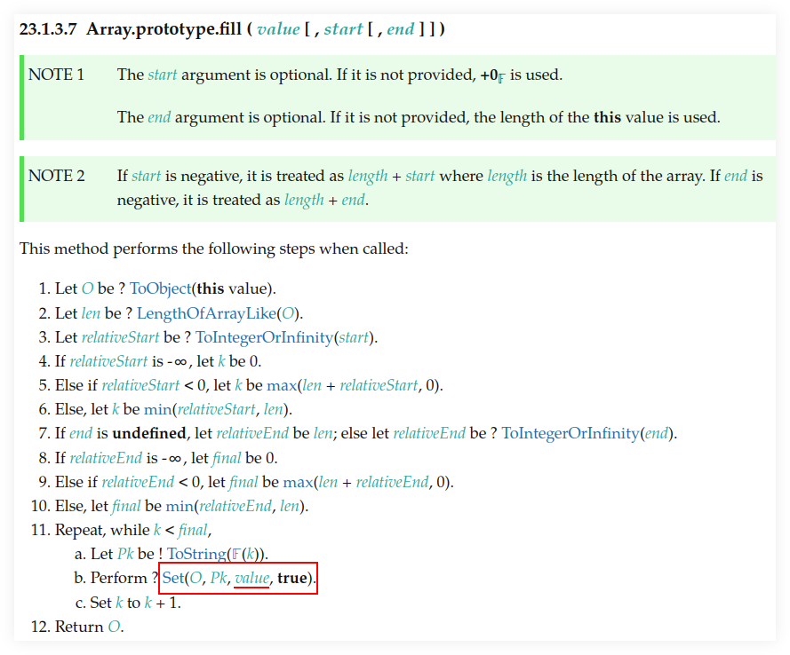

= Array Tips
:page-tags: array algorithm
:toc: right
:stem:
:icons: font

[data-date="2022-10-29",data-tags="array swap"]
== Swap array element

.stood the test of time
----
tmp = xs[idx1];
xs[idx1] = xs[idx2];
xs[idx2] = tmp;
----

Not all languages allow something like this:

.smart approach
----
[xs[idx1], xs[idx2] = [xs[idx2], idx[1]]
----

.ES6 example:
----
$ deno repl (or node --interactive):

> var chars = ['a', 'c', 'b'];

> [chars[1], chars[2] = chars[2], chars[1]]
[ "c", "b", "c" ]

> chars
[ "a", "c", "b" ]
----

[source,javascript,lineos]
----
function swap(
  xs: number[],
  idx1: number,
  idx2: number,
): void {
  [xs[idx1], xs[idx2]] = [xs[idx2], xs[idx1]];
}
----

* https://stackoverflow.com/questions/872310/javascript-swap-array-elements#comment131093228_872317[Javascript swap array elements (StackOverflow)^]

## Array.prototype.fill() problem‽

.node repl session example
[source,text]
----
$ node --interactive

> var buckets = Array(10).fill([]);

> buckets
[
  [], [], [], [], [],
  [], [], [], [], []
]

> buckets[5].push(35);
1
> buckets
[
  [ 35 ], [ 35 ],
  [ 35 ], [ 35 ],
  [ 35 ], [ 35 ],
  [ 35 ], [ 35 ],
  [ 35 ], [ 35 ]
]
----

Want to push 35 to the 5th bucket, but all of the buckets get filled 😭.

The problem seems to be `Array(10).fill()`, because this works:

[source,text]
----
> var buckets = [[], [], [], [], [], [], [], [], [], []];

> buckets.length
10
> buckets[5].push(35);
1
> buckets
[
  [], [], [],
  [], [], [ 35 ],
  [], [], [],
  []
]
----

Note only sub-array at index 5 got pushed the value 35.

See link:https://tc39.es/ecma262/multipage/indexed-collections.html#sec-array.prototype.fill[the spec] and link:https://developer.mozilla.org/en-US/docs/Web/JavaScript/Reference/Global_Objects/Array/fill[MDN docs].

> pass:[[...]]changes all elements in an array to a *static* value[...]
> -- MDN Docs on Array.prototype.fill()

It all means when we fill with `[]` (which is a reference type and not a primitive), all positions are filled with the same object in memory, and not 10 different empty arrays.
It is the same array in memory, used 10 times.

=== Clever approach

OK, we can manually do this:

----
[[], [], [], [], [] (many more []s here...)]
----

But what if we need 100 or 500 (ore more) sub-arrays?

----
$ deno repl
Deno 1.28.2

> var xs = Array.from({ length: 1e5 }, () => []);

> xs.length
100000

> Array.from({ length: 10 }, () => []);
[
  [], [], [], [], [],
  [], [], [], [], []
]
----

This works because the anonymous arrow function is invoked each for each one of the stem:[1 \times 10 ^ 5] (100_000) elements we want to create so we end up with 100000 different empty array references in memory.

And note it creates an array containing `length` arrays.

[TIP]
====
Did you know we can write 100_000_000 instead of 100000000 in ECMAScript to make large numbers more readable‽
====

== Concatenate (flatten) arrays

First, let's see the basics of how `Array.prototype.concat()` works:

.deno repl simple concat()
----
$ deno repl

> var a1 = [10, 20];
> var a2 = [30, 40];

> var all = a1.concat(a2);

> all
[ 10, 20, 30, 40 ]
----

Note the result is *not* something like:

----
[[10, 20], [30, 40]]
----

No, it is instead a flat result of the `a1` and `a2`.
Of course, both `a1` and `a2` are flat themselves, so, concat'ing them produces a flat result.

.deno repl flatten (NOK)
----
> var xs = [[10, 20], [30, 40], [50, 60]];

> var flat = [].concat(xs);

> flat
[ [ 10, 20 ], [ 30, 40 ], [ 50, 60 ] ]
----

We still got an array with nested arrays instead of a flattened array with all elements of the original sub-arrays...

One solution:

.deno repl flatten loop (OK)
----
var xs = [[10, 20], [30, 40], [50, 60]];

> var flat = [];
> for (var i = 0; i < xs.length; ++i)
    flat = flat.concat(xs[i]);

> flat
[ 10, 20, 30, 40, 50, 60 ]
----

But note how we have to reassign `flat` (`concat()` does not modify the receiver).

Another solution is this:

.deno repl flatten spread (OK)
----
> var xs = [[10, 20], [30, 40], [50, 60]];

> var flat = [].concat(...xs);

> flat
[ 10, 20, 30, 40, 50, 60 ]
----

This works because `...xs` will expand to each individual sub-array, which are each concat'ed correctly and we end up with a flattened array.

== Generate an array of random numbers

[source,javascript]
----
Array.apply(null, { length: 1e5 })
  .map(Function.call, Math.random);
----

On the repl:

----
$ deno repl

> Array.apply(null, { length: 4 })
  .map(Function.call, Math.random);
[
  0.013555371023429963,
  0.4090884169905944,
  0.05656425921292585,
  0.29989721347892306
]
----

We can create some helper functions.

.librand.js
[source,javascript]
----
var random = Math.random.bind(Math);

/**
 * Generates a random integer between `min` (inclusive)
 * and `max` (exclusive).
 *
 * A `rand(1, 5)` may return 1, 2, 3 or 4 but never 5.
 *
 * @sig Number Number -> Number
 */
function rand(min, max) {
  return (random() * (max - min) | 0) + min;
}

// var i = 0;
// while (i++ < 1e1) log(rand(1, 5));

/**
 * Generates an array of `len` random integers between
 * `min` (inclusive) and `max` (exclusive).
 *
 * @sig Number -> [Number]
 */
function randIntArr(len, min = 1, max = 100) {
  return Array.apply(null, { length: len })
    .map(Function.call, () => rand(min, max));
}

export {
  random,
  rand,
  randIntArr,
};
----

And then we can try it:

.node repl random ints
----
$ node --interactive
var mod = await import('./librand.js');

var { rand, randIntArr } = mod;

> rand(-5, 0);
-3
> rand(10, 15);
11
> rand(10, 15);
13

> randIntArr(12, 5, 10);
[
  8, 7, 6, 6, 5,
  7, 9, 9, 5, 6,
  7, 6
]

> randIntArr(25, -10, 10);
[
   0, -5,  1,  5, 0, -7, -5,  8,
   2,  9, -9, -6, 7,  3, -5, -3,
  -8,  9,  2, -3, 7, -4, -8,  4,
  -9
]
----
