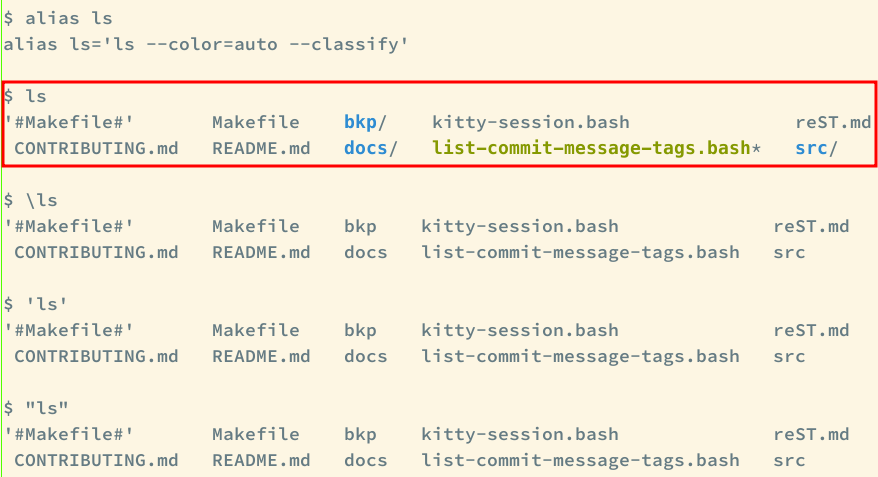

== Bash Aliases

=== Intro

Read the link:https://www.gnu.org/savannah-checkouts/gnu/bash/manual/bash.html#Aliases[bash docs on aliases].
Basically, we do something like this:

[source,bash]
----
alias ls='ls --classify --color=auto'
alias tt='tree -CFa'
----

Then, when we run the command `ls`, it will actually run `ls --classify --color=auto` and when we run `tt` it will actually run `tree -CFa`

=== How To Unalias‽

We _aliased_ `ls` to `ls`.
It is not uncommon to do this for some commands.
But what if we want to run the “original” `ls`, not its aliased version?
What if we don't want `--classify` or `--color=auto` in a given situation?
Then we can make prevent the shell from treating the word as an alias to be expanded.

The bash man page on the Aliases section states that:

____
"The first word of each simple command, if unquoted, is checked to see if it has an alias.
If so, that word is replaced by the text of the alias."

-- Bash man page on the Aliases section
____

According to the man page, if we quote the word, bash won't try to treat
it as an alias to be expanded.

How do we do this _quoting_ thing‽ We can use either single or double
quotation marks or escape it with a basckslash.

The screenshot shows how to see what an alias expands to (`alias ls`)
and then proceeds to first run the aliased `ls`, which shows
classification indication (“/” at the end of directories, “__” at the
end of executable files, etc. and different colors for different types
of files as well, like bluish for directories and greenish for
executables). Then, the remaining three commands show the ways to quote
a__word*.

[NOTE]
.Note
====
In bash, in certain contexts the basckslash *is not* an escape, but a
quoting mechanism.
====

=== Manually Expanding Aliases

When the word at the cursor is an alias, we can expand it. For example,
type `ls``Esc``Tab`. [.title-ref]#Esc# can also be triggered with
`Ctrl-[`.

[source,shell-session]
----
$ alias ls='ls --classify --color=always'
$ ls<Esc><Tab>
----

The line gets replaced with:

[source,shell-session]
----
$ ls --classify --color=always
----

=== Tricky aliases 😮

One could be evil and create an alias with this:

[source,bash]
----
alias '\ls'='ls ...'
----

Then one would try to prevent the `ls` alias with `\ls` but that would
be itself an alias... Thankfully, as of 2021 (at least), Bash doesn't
allow aliases name like that.

Another example:

[source,shell-session]
----
$ 'he'
-bash: he: command not found

$ alias w00t='echo w00t'

$ w00t
w00t

$ \w00t
-bash: w00t: command not found

$ 'w00t'
-bash: w00t: command not found
----
