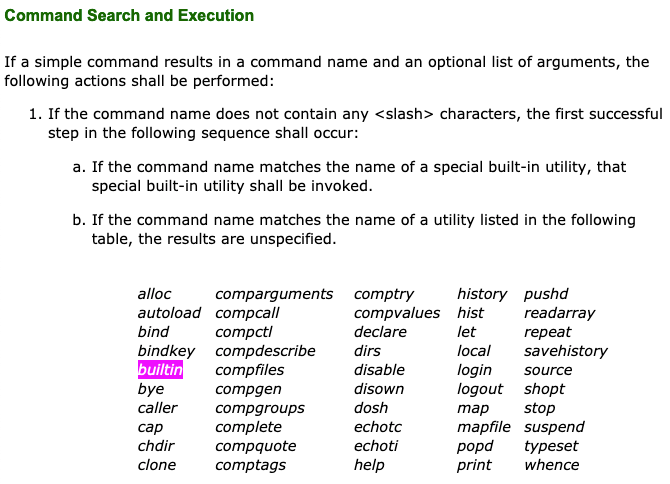

= Shell Built-In Commands
:toc: left
:icons: font

== Intro

A built-in is a command provided by the shell itself, not a program stored somewhere in the path.

Bash's man page uses the spelling _bultin_.
Zsh man page seems to use a mix of _built-in_ and _builtin_.
The https://pubs.opengroup.org/onlinepubs/9699919799/utilities/V3_chap02.html#tag_18_14[POSIX
spec for the Shell Command Language] seems to strictly use _built-in_ to describe shell built-in commands (“builtin” is mentioned once as a reserved name; see below).
Let’s attempt to consistently use POSIX spelling *built-in* in our text.

== POSIX builtin reserved word

The POSIX spec does not define a built-in command called `builtin`, but makes it a “reserved word”.
Note, especially, this line:

[quote, posix spec]
If the command name matches the name of a utility listed in the following table, *the results are unspecified*."

.

https://pubs.opengroup.org/onlinepubs/9699919799/utilities/V3_chap02.html#tag_18_09_01_01

== Shells implementation of builtin

Shells have implemented that utility called `builtin` (_builtin_ here is the actual name of the command) for their (the shell's) specific purposes.
For example, in Bash:

[source,shell-session]
----
$ help builtin
builtin: builtin [shell-builtin [arg ...]]
    Execute shell builtins.

    Execute SHELL-BUILTIN with arguments ARGs without performing command
    lookup.  This is useful when you wish to re-implement a shell builtin
    as a shell function, but need to execute the builtin within the function.

    Exit Status:
    Returns the exit status of SHELL-BUILTIN, or false if SHELL-BUILTIN is
    not a shell builtin.
----

One such use case is with `cd`.
We may find it useful to have a function `cd` that when executed first does some other thing, like checking for the existence and reading an `.env` file in the `cd`ed directory, and *then* actually invoking the builtin `cd` to that directory.
Something like:

[source,bash]
----
##
# Read .env.txt (if it exists) when changing to a directory.
#
cd () {
  builtin cd "$@"

  if [[ -f ./.env.txt ]]
  then
    cat .env.txt
  fi
}
----

We could use this approach to read `.nvmrc`, `.rvmrc`, or any other project-related setup file for whatever language, library or framework we may be working with.
