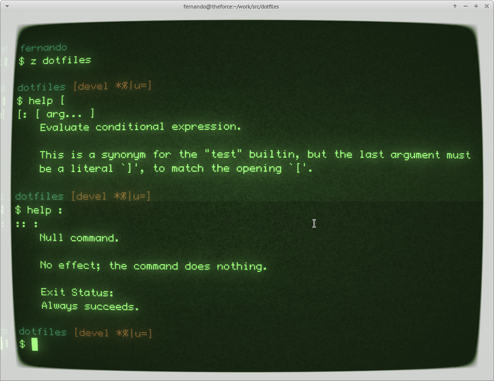

= Command Line

help-info-man built-in argument-syntax echo-printf bash-brace-expansion
bash-parameter-expansion bash-aliases bash-arrays terminal/index tar.md
find.md hackerrank-shell

== Intro

Command line tools have NOT faded out into the past. They have kept
consistently evolving and being improved. They still do! A lot of GUI
interfaces use command line tools behind the scenes.

There exists a specification to standardize how command line utilities
should behave so that they work in a cross-platform, interoperable way.

GNU and BSD command line utilities generally try to follow the specs but
add the so called _extensions_ which add further capabilities to the
tools, making writing scripts and programs easier and sometimes less
verbose, but also reduce the portability. Some tools can be run in a
more restrict way that disallow extensions. The docs for each tool
should specify those things. Information about these things is also
scattered across this website's notes and examples when they are deemed
important and/or worthwhile.

Besides reading the specs, also take a look at the sidebar about reading
and understanding man pages, info pages and help pages.

[NOTE]
.Note
====
Assume all text and examples on this site is written considering GNU
tools and the Bash shell unless otherwise noted.
====

== Single Unix Specification (SUS)

* https://pubs.opengroup.org/onlinepubs/9699919799/idx/xbd.html[XBD:
Base Definitions]
* https://pubs.opengroup.org/onlinepubs/9699919799/idx/xsh.html[XSH:
System Interfaces and XBD Headers]
* https://pubs.opengroup.org/onlinepubs/9699919799/idx/xcu.html[XCU:
Shell and Utilities (Commands and Utilities)]

More info on the link
https://pubs.opengroup.org/onlinepubs/9699919799[The Open Group Base
Specifications Issue 7&#44; 2018 edition]. There is also a question about
the
https://unix.stackexchange.com/questions/14368/difference-between-posix-single-unix-specification-and-open-group-base-specifi/14369[difference
between SUS and Open Group].

=== Yes, That Website Sucks

Yes, that website sucks. Not the contents of the website, but the way it
works!

The whole thing is full of iframes. URLs don't change (only the iframes
contents do) when we click on sidebar links which means it is impossible
to share or bookmark different URLs do. HOWEVER, if we *open links on a
new tab* then we get out of the iframe hell thing. So, open links on a
new tab when you need the URL for that link.

== GNU Coreutils

[NOTE]
.Note
====
The examples on this site assume GNU tools and GNU Coreutils. If you
find something that doesn't work on your version/vendor of the tool,
feel free to open a PR to this project proposing an alternative working
solution.
====

It is worth taking a look at following resources:

* https://www.gnu.org/software/coreutils/[GNU Coreutils Home Page]
* https://www.gnu.org/software/coreutils/faq/coreutils-faq.html[GNU
Coreutils FAQ]
* https://www.gnu.org/software/coreutils/manual/[GNU Coreutils
Documentation]
* http://www.maizure.org/projects/decoded-gnu-coreutils/[GNU Coreutils
Decoded]

There is also the mind-blowing, awesome
http://www.maizure.org/projects/decoded-gnu-coreutils/[Decoded GNU
Coreutils] project by http://www.maizure.org/projects/faq.html[MaiZure].

== Other Awesome Command Line Tools

* https://github.com/landley/toybox[ToyBox^]
* http://joeyh.name/code/moreutils[MoreUtils^]
