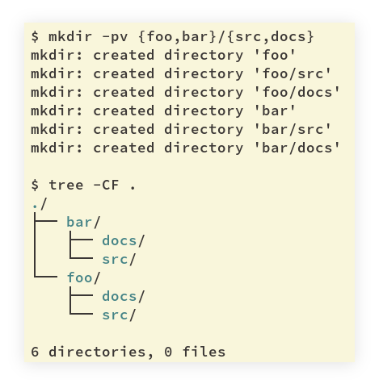

= mkdir

[data-tags="mkdir bash shell expansion parent"]
== mkdir with shell expansion

.example mkdir -pv
----
$ mkdir -pv {foo,bar}/{src,docs}
mkdir: created directory 'foo'
mkdir: created directory 'foo/src'
mkdir: created directory 'foo/docs'
mkdir: created directory 'bar'
mkdir: created directory 'bar/src'
mkdir: created directory 'bar/docs'

$ tree -CF .
./
├── bar/
│   ├── docs/
│   └── src/
└── foo/
    ├── docs/
    └── src/

6 directories, 0 files
----

