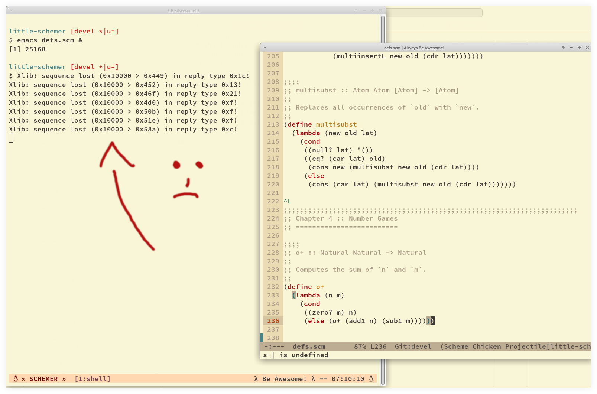

= Shell Redirects
:page-tags: shell bash redirect stdin stdout stderr
:icons: font
:toc: left

== Redirect all messages to /dev/null

Sometimes we just want the terminal to be silent and not pollute the output with noise that may not matter for a given situation and ends up taking our attention away from whatever we are doing.
See here one example:

[NOTE]
====
I do not advise hiding terminal messages in general, but sometimes it may be desirable for specific situations.
====

For bash >= 4, we can simply do:

.redir stderr and stdout to /dev/null, bash >= 4 only
[source,shell-session]
----
$ emacs ./main.scm &> /dev/null &
----

Of course one may prefer to redirect to a text file instead:

.redir stderr and stdout to text file
[source,shell-session]
----
$ emacs ./main.scm &> ./out.txt &
----

For bash < 4 or other shells, this is a more portable approach:

.redir stderr and stdout to /dev/null, portable
[source,shell-session]
----
$ emacs ./defs.scm > /dev/null 2>&1 &
----

Or

.redir stderr and stdout to text file, portable
[source,shell-session]
----
$ emacs ./defs.scm > ./out.txt 2>&1 &
----

Note we first `> /dev/null` then we redirect STDERR to STDOUT with `2>&1`.

In all cases, the final `&` is used to free the prompt as the process then is run in the background.
