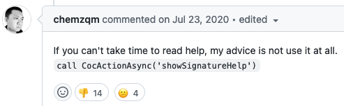
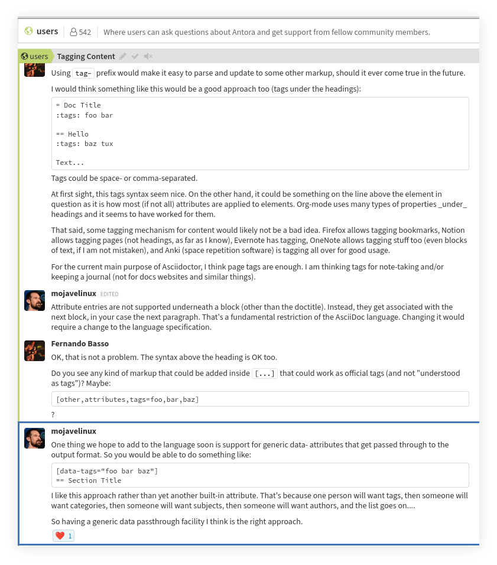

= 2022-10-23, Sun
:toc: left

[data-tags="algorithm for break return]
== for loop break vs return

----
/**
 * Returns the index where `n` first appears in `xs`; else `-1`.
 *
 * Linear searching algorithm. Does NOT assume the input is sorted.
 *
 * - T.C: O(n).
 * - S.C: O(1).
 *
 * @sig [Number] -> Number
 */
export function searchNum(xs: number[], n: number): number {
  let foundIdx = -1;

  for (let idx = 0; idx < xs.length; ++idx) {
    if (xs[idx] === n) {
      foundIdx = idx;
      break;
    }
  }

  return foundIdx;
}
----

This `break` thing is dumb for this situation.
Just do `return i`  instead 🤣.
It also has means `foundIdx` variable is not even needed.

----
/**
 * Returns the index where `n` first appears in `xs`; else `-1`.
 *
 * Linear searching algorithm. Does NOT assume the input is sorted.
 *
 * - T.C: O(n).
 * - S.C: O(1).
 *
 * @sig [Number] -> Number
 */
export function searchNum(xs: number[], n: number): number {
  for (let idx = 0; idx < xs.length; ++idx) {
    if (xs[idx] === n) {
      return idx;
    }
  }

  return -1;
}
----

[data-tags="coc vim pupup completion"]
== vim manually trigger completion popup

----
:help coc#refresh()

Start or refresh completion at current cursor position, bind this to
'imap' to trigger completion, example:

  if has('nvim')
    inoremap <silent><expr> <c-space> coc#refresh()
  else
    inoremap <silent><expr> <c-@> coc#refresh()
  endif
----

The problem is that `<c-space>` does not work in some terminals, or if there is some plugin already using it, or whatever...

This works, though:

----
:inoremap <silent><expr> <c-\> coc#refresh()
----

Then we can set `autoTrigger` to `none` and only trigger the popup manually when wanted:

----
:CocLocalConfig

{
  "deno.enable": true,
  "deno.importMap": "./import_map.json",
  "tsserver.enable": false,
  "suggest.autoTrigger": "none"
}
----

* https://vi.stackexchange.com/questions/23323/configuring-coc-open-suggestion-box-with-shortcut-only[Configuring CoC -- open suggestion-box with shortcut only^]
* https://github.com/neoclide/coc.nvim/issues/2202#issuecomment-662969193[How to toggle parameter hint?^]

[data-tags="asciidoc tags spec"]
== Asciidoctor Tagging Content

* https://antora.zulipchat.com/#narrow/stream/282400-users/topic/Tagging.20Content[Antora Chat Tagging Content^].
* https://www.eclipse.org/lists/asciidoc-wg/msg00646.html[Asciidoc WG 2022/2023 Plans^]

