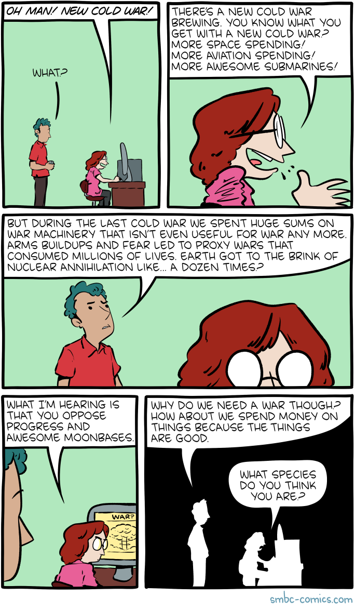

= 2022-10-24, Sun
:toc: left

[data-tags="tar gnu command-line shell"]
== Un-tar to specific directory

[source,shell-session]
----
$ tar \
    --verbose \
    -xf ~/Cloud/MyDrive/md-img-paste.vim.tar \
    --directory ~/work/src/projects/

md-img-paste.vim/
md-img-paste.vim/plugin/
md-img-paste.vim/plugin/mdip.vim
md-img-paste.vim/test/
md-img-paste.vim/test/load_clipboard_macos
md-img-paste.vim/test/Doge.png
md-img-paste.vim/test/run
md-img-paste.vim/README.adoc
md-img-paste.vim/doc/
md-img-paste.vim/doc/mdip.txt
md-img-paste.vim/doc/tags
----

The result is `~/work/src/projects/md-img-paste.vim` as a directory (and not scattered files i `~/work/src/projects/`).

[NOTE]
====
Tried and tested this with GNU tar.
====

[data-tags="tar command-line shell"]
== tar pack ignoring certain directories

Pack Excluding Directories

Useful command to create an archive of a React/Vue.js where we want avoid including node_modules and dist directories:

[source,shell-session]
----
tar \
    --exclude './myapp-poc1/node_modules' \
    --exclude './myapp-poc1/dist' \
    -cf myapp-poc1.tar \
    ./myapp-poc1

du -h myapp-poc1.tar
800K	myapp-poc1.tar
----

[data-tags="comic funny software smbc"]
== Cold War

* https://www.smbc-comics.com/comic/cold-war

[data-tags="arch-linux steam game lib libcrypt"]
== Missing libcrypt.so.1, Alien Isolation Steam Arch Linux 

.error excerpt
----
.local/share/Steam/steamapps/common/Alien Isolation/bin/AlienIsolation:
error while loading shared libraries: libcrypt.so.1:
cannot open shared object file: No such file or directory
----

* https://unix.stackexchange.com/questions/691479/how-to-deal-with-missing-libcrypt-so-1-on-arch-linux[How to deal with missing libcrypt.so.1 on Arch Linux?^]

