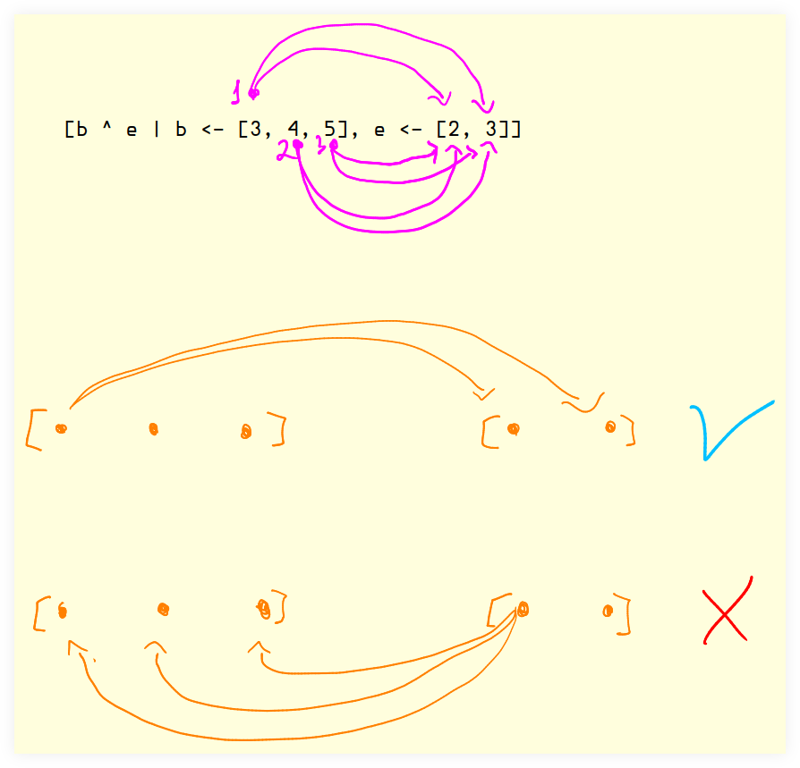

= List Comprehensions :: Haskell
:page-tags: haskell list
:toc: left
:icons: font
:stem: latexmath

== Intro

List comprehensions are a means of generating a new list from one or more lists.
The concept comes from set comprehensions in math, including the syntax.

From the generator list `[1 .. 5]`, add one to each number.

[source,haskell]
----
allNums :: [Int]
allNums = [x + 1 | x <- [1 .. 5]]
--         -----         ------
--           |             /
--           v            /
--     resulting list    /
--                      v
--                generator list
----

The pipe “|” character is syntax to separate what is output (left) and input (right).
The `x` variable on the right is bound to each element, one at a time, from the generator list that satisfies the predicate(s), if any.

Another example: from the generator list `[1 .. 5]`, return a list containing only the odd numbers.
Not the comma after the generator and then the predicate.

[source,haskell]
----
oddNums :: [Int]
oddNums = [x | x <- [1 .. 5], odd x]
--                              /
--                             /
--                            v
--                        predicate
----

Predicates must evaluate to `Bool` values.

[NOTE]
====
The link:https://www.haskell.org/onlinereport/haskell2010/haskellch3.html#x8-420003.11[spec^] calls these predicates _boolean guards_.

> ...boolean guards, which are arbitrary expressions of type `Bool`.
====

When multiple generators are provided, the rightmost ones are exhausted (consumed) first.
Consider:

[source,ghci]
----
λ> [b ^ e | b <- [3, 4, 5], e <- [2, 3]]
[9,27,16,64,25,125]
----

Instead of evaluating all values from the leftmost generator (3, 4, 5) to the first element of the rightmost generator, that is, stem:[3 ^ 2], stem:[4 ^ 2], then stem:[5 ^ 2], what happens instead is that the 3 from the leftmost generator is raised to all exponents of the rightmost generator first, e.g. stem:[3 ^ 2] then stem:[3 ^ 3], and only then the evaluation proceeds to the second element of the first generator.

And a predicate could be used to limit the resulting list to include only certain values, like even, odd, less than some value, more than some value, etc:

[source,ghci]
----
λ> [b ^ e | b <- [3, 4, 5], e <- [2, 3], odd (b ^ e)]
[9,27,25,125]
λ> [b ^ e | b <- [3, 4, 5], e <- [2, 3], even (b ^ e)]
[16,64]
λ> [b ^ e | b <- [3, 4, 5], e <- [2, 3], (b ^ e) < 100]
[9,27,16,64,25]
λ> [b ^ e | b <- [3, 4, 5], e <- [2, 3], (b ^ e) > 100]
[125]
----

Generate a list of tuples from two generators:

[source,haskell]
----
tups :: [] (Int, Int)
tups = [(x, y) | x <- [10, 20], y <- [-1, -2, -3]]
-- [(10,-1),(10,-2),(10,-3),(20,-1),(20,-2),(20,-3)]
----

The generator lists don't have to be of the same length, and, because tuples can contain elements of different types, the generator lists themselves can each be of a different type.

[source,haskell]
----
them :: [] (Int, Char)
them = [(n, c) | n <- [1, 2], c <- ['a', 'b', 'c']]
-- [(1,'a'),(1,'b'),(1,'c'),(2,'a'),(2,'b'),(2,'c')]
----

== Resources

* link:https://www.haskell.org/onlinereport/haskell2010/haskellch3.html#x8-420003.11[List Comprehensions :: Haskell 2010 Report^]
