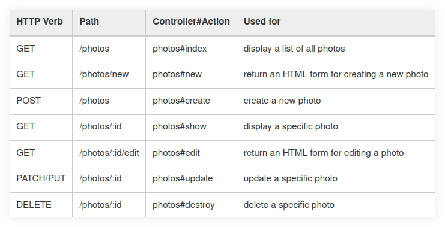

= Action Pack :: Rubh on Rails
:icons: font
:toc: left

== Action Pack Components

Action Pack is the controller and the view. Some of the modules that make up Action Controller are:

- Action Controller
- Action View
- Action Dispatch, routing! (decides which controller should handle a particular request).

== Controller Walk-Through

* [Ruby on Rails docs on routing](https://guides.rubyonrails.org/routing.html).

This route definition (`routes.rb`):

----
get '/books/home', to: 'books#index'
----

...works for `rorapp.local:3000/books/home`

Route:

----
get '/books/search/:query, to: 'books#search
----

Matches URLs like thse:

* `rorapp.local:3000/books/search/ruby`
* `rorapp.local:3000/books/search/lisp`

== Named Routes

Named route:

----
get '/books/search/:query, to: 'books#search', as: search
----

The above route named as ‘search’ creates helper methods:

----
link_to 'Search', search_path
----

Which in turns generate the markup like this:

----
<a href='/books/search'>Search</a>
----

## Resources and RESTful routes

[source,ruby]
----
Rails.application.routes.draw do
  resources :photos
end
----

The route definition above produces a few named routes:

----
photo_path      => /photos/:id
photos_path     => /photos
edit_photo_path => /photos/:id/edit
new_photo_path  => /photos/new
----

Those four helper methods combined with the HTTP verbs, all controller actions can be handled:

.Photos named route helper methods, (source: link:https://guides.rubyonrails.org/routing.html#crud-verbs-and-actions[Ruby on Rails Guides]).

== rails routes command

To see all routes:

[source,shell-session]
----
$ bin/rails routes
----

Check the `--help`:

[source,shell-session]
----
$ bin/rails routes --help
Usage:
  rails routes [options]

Options:

  -c, [--controller=CONTROLLER]
    Filter by a specific controller, e.g. PostsController
    or Admin::PostsController.

  -g, [--grep=GREP]
    Grep routes by a specific pattern.

  -E, [--expanded], [--no-expanded]
    Print routes expanded vertically with parts explained.
----

As the output can be very wide and hard to see on the screen because of wrapping lines, one may want to open that output in an editor and disable line wrapping (and then do lateral scrolls, maybe):

[source,shell-session]
----
$ bin/rails routes | vim -
$ emacs --insert <(bin/rails routes)
----

Then, in vim, `:set nowrap`.
If your editor does not easily allow reading from STDIN, dump to a file first then open it:

[source,shell-session]
----
$ bin/rails routes > ./routes-dump.txt
$ <your-editor> ./routes-dump.txt
----

[source,shell-session]
----
$ bin/rails routes --controller=articles
      Prefix Verb   URI Pattern                  Controller#Action
    articles GET    /articles(.:format)          articles#index
             POST   /articles(.:format)          articles#create
 new_article GET    /articles/new(.:format)      articles#new
edit_article GET    /articles/:id/edit(.:format) articles#edit
     article GET    /articles/:id(.:format)      articles#show
             PATCH  /articles/:id(.:format)      articles#update
             PUT    /articles/:id(.:format)      articles#update
             DELETE /articles/:id(.:format)      articles#destroy
----

We can use `article`, 'articles', 'ArticlesController'.
All filter by the articles controller.
